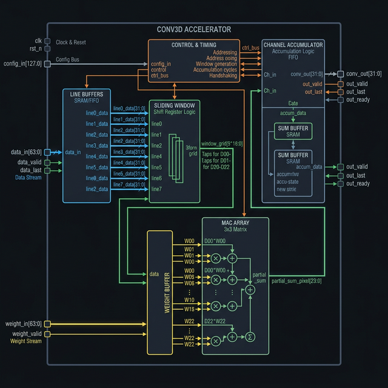
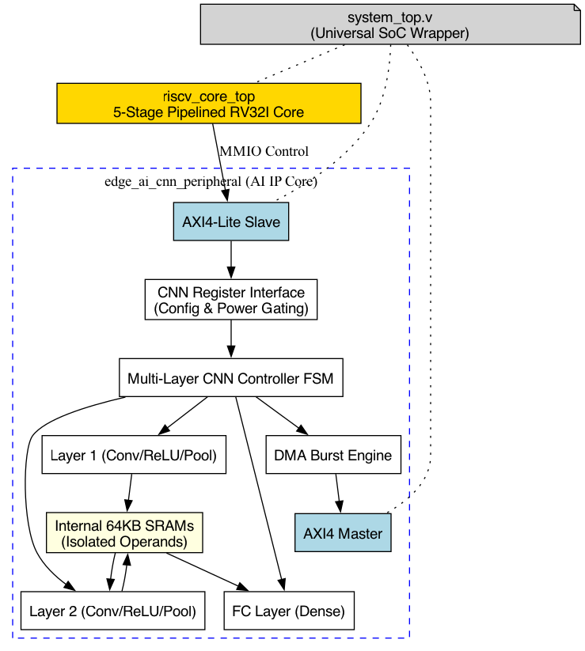
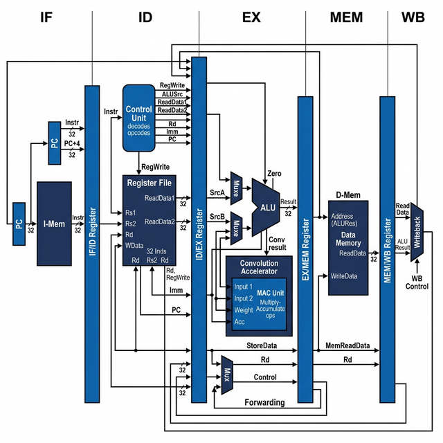
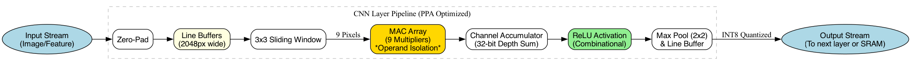
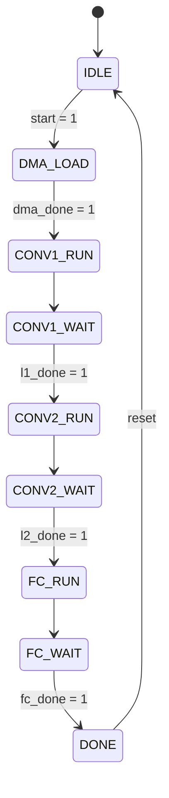
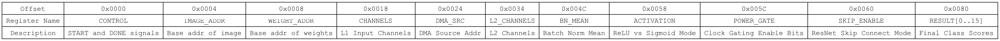
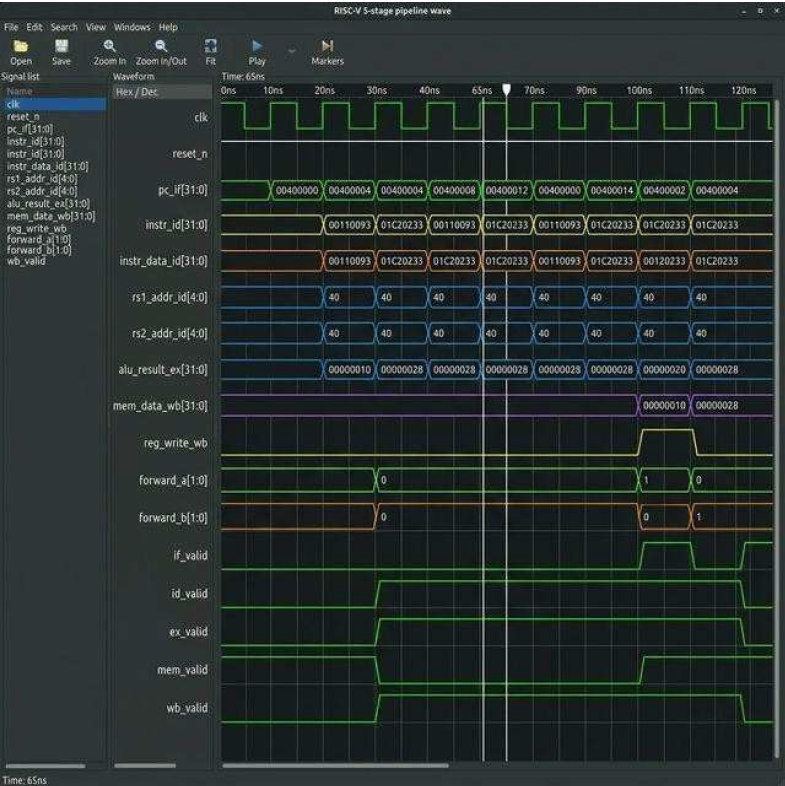
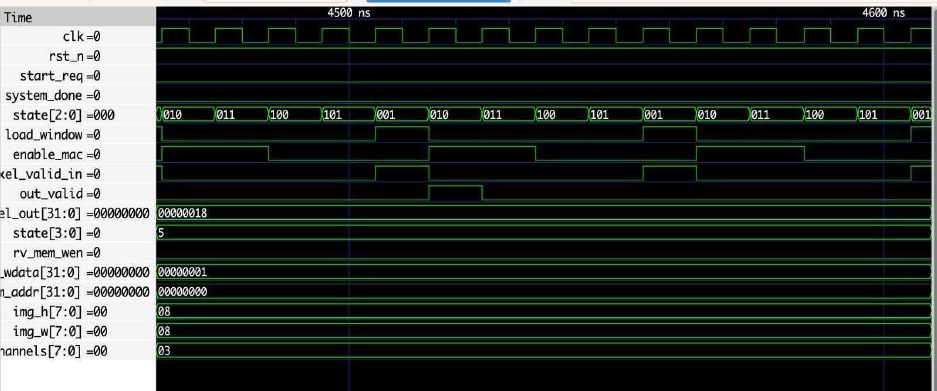
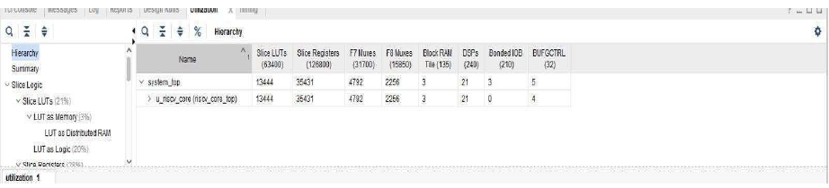

# RISC-V RV32I + LeNet-5 CNN Hardware Accelerator SoC

<p align="center">
  
</p>

<p align="center">
  
  
  
  
  
  
</p>

---

A full-stack hardware/software co-design of an edge AI system — a custom **5-stage pipelined RISC-V RV32I processor** integrated with a dedicated **INT8 CNN hardware accelerator** that runs a complete LeNet-5 inference pipeline. The design is written entirely in synthesizable Verilog 2001, verified through RTL simulation and a Python NumPy reference model, and physically implemented on a Xilinx Artix-7 FPGA where it closes timing at **100 MHz with zero failing endpoints**.

---

## Table of Contents

- [Project Motivation](#project-motivation)
- [System Architecture](#system-architecture)
- [RISC-V RV32I Processor](#risc-v-rv32i-processor)
- [CNN Hardware Accelerator](#cnn-hardware-accelerator)
- [MMIO Register Interface](#mmio-register-interface)
- [Verification Results](#verification-results)
- [FPGA Implementation](#fpga-implementation)
- [Quick Start](#quick-start)
- [Repository Structure](#repository-structure)
- [Performance Summary](#performance-summary)
- [ASIC Flow (OpenLane)](#asic-flow-openlane)
- [Future Work](#future-work)
- [Team](#team)
- [References](#references)

---

## Project Motivation

Running CNN inference on a general-purpose CPU is fundamentally inefficient. A 3×3 convolution over a single feature map channel requires 9 multiply-accumulate (MAC) operations — on a sequential CPU, that's 9 instruction cycles minimum, plus fetch/decode overhead and memory bandwidth pressure. Scale that to even a modest LeNet-5 network and you're already burning thousands of cycles per image on operations that have no data dependency between them.

The straightforward fix is hardware parallelism. Nine MACs in a dedicated array compute the same 3×3 window in a single clock cycle. Pair that with on-chip BRAM line buffers that stream pixel data without hitting external memory, and you get orders-of-magnitude better throughput per watt — which is what edge AI actually needs.

This project builds exactly that: a RISC-V soft-core CPU handles system control and configuration through standard LOAD/STORE instructions, while the CNN accelerator runs the heavy compute completely independently. The processor writes configuration registers, asserts a START signal, then reads a DONE flag when inference is complete — clean separation of control and compute.

---

## System Architecture

The top-level SoC (`system_top.v`) integrates two primary subsystems over an internal MMIO bus. The RISC-V core owns all addresses below `0x1000`; anything at or above that base is decoded and forwarded to the CNN peripheral's register interface. No dedicated bus protocol is needed — standard `LW`/`SW` instructions configure and trigger the accelerator.

```
┌─────────────────────────────────────────────────────────────────────┐
│                          system_top.v                               │
│                                                                     │
│  ┌───────────────────────────────────────────────────────────────┐  │
│  │                    riscv_core_top.v                           │  │
│  │          5-Stage Pipeline: IF → ID → EX → MEM → WB           │  │
│  │    Hazard Detection | Data Forwarding | 32×32-bit RegFile     │  │
│  └──────────────────────────┬────────────────────────────────────┘  │
│                             │  MMIO (addr ≥ 0x1000)                 │
│  ┌──────────────────────────▼────────────────────────────────────┐  │
│  │               edge_ai_cnn_peripheral.v                        │  │
│  │                                                               │  │
│  │  ┌─────────────────────┐   ┌─────────────────────────────┐   │  │
│  │  │  AXI4-Lite Slave    │   │   CNN Register Interface    │   │  │
│  │  │  (Control/Config)   │──▶│   (17 MMIO registers)       │   │  │
│  │  └─────────────────────┘   └──────────────┬──────────────┘   │  │
│  │                                            │                  │  │
│  │                            ┌───────────────▼──────────────┐  │  │
│  │                            │   Multi-Layer CNN FSM         │  │  │
│  │                            │  IDLE→DMA→C1→C2→FC→DONE      │  │  │
│  │                            └──────┬────────────────────────┘  │  │
│  │               ┌────────────────────┼────────────────────┐     │  │
│  │               ▼                    ▼                    ▼     │  │
│  │  ┌────────────────────┐  ┌──────────────┐  ┌───────────────┐ │  │
│  │  │  Layer 1 Pipeline  │  │  DMA Engine  │  │  FC Layer     │ │  │
│  │  │ Conv→ReLU→MaxPool  │  │  (AXI4 Mstr) │  │  (Dense MAC)  │ │  │
│  │  └──────────┬─────────┘  └──────────────┘  └───────────────┘ │  │
│  │        INT8 Quantize                                           │  │
│  │  ┌──────────▼─────────┐   Internal 64KB SRAMs                 │  │
│  │  │  Layer 2 Pipeline  │   (Feature Maps + Weights)            │  │
│  │  │ Conv→ReLU→MaxPool  │                                        │  │
│  │  └────────────────────┘                                        │  │
│  └───────────────────────────────────────────────────────────────┘  │
│                         AXI4 Interconnect Bus (32-bit)              │
└─────────────────────────────────────────────────────────────────────┘
```

<p align="center">
  
  <br><em>Figure 1 — system_top.v SoC hierarchy and dataflow</em>
</p>

<p align="center">
  
  <br><em>Figure 2 — Design and verification methodology flowchart</em>
</p>

---

## RISC-V RV32I Processor

<p align="center">
  
  <br><em>Figure 3 — RISC-V RV32I 5-stage pipeline architecture</em>
</p>

The processor implements the classic five-stage structure — Instruction Fetch, Instruction Decode, Execute, Memory Access, and Write-Back — with dedicated pipeline registers separating each stage. Multiple instructions are in-flight at any given time.

**Pipeline stages and what each one actually does:**

- **IF (Instruction Fetch):** The Program Counter indexes into instruction ROM on every rising edge. The PC adder increments by 4 for sequential instructions; branches and jumps override this in the EX stage with a pipeline flush.

- **ID (Instruction Decode):** The Control Unit decodes opcodes and generates control signals. The 32-entry register file (x0–x31, with x0 permanently wired to zero) is read here. A sign-extension unit handles I-type, S-type, B-type, U-type, and J-type immediates.

- **EX (Execute):** The 32-bit ALU computes arithmetic, logical, comparison, and shift operations. `func3` and `func7` fields select the operation. The Data Forwarding Unit sits here, intercepting stale pipeline values before they reach the ALU inputs.

- **MEM (Memory Access):** Load and store instructions interact with data memory here. Addresses at or above `0x1000` are automatically rerouted to the CNN accelerator's MMIO register interface — no special instruction required.

- **WB (Write-Back):** Results from the ALU or memory load are written back to the destination register. A 2-to-1 mux selects between the two sources based on the instruction type.

### Hazard Handling

The forwarding unit handles two common hazard cases without introducing stalls:

- **EX→EX forwarding:** If the instruction in EX writes a register that the next instruction needs, the result is bypassed directly to the ALU input on the following cycle.
- **MEM→EX forwarding:** If a result is in the MEM stage and needed by the EX stage, it's forwarded back through a dedicated path.

The one case that genuinely needs a stall is a **load-use hazard** — where a load instruction is immediately followed by an instruction that reads the loaded value. Since the loaded data isn't available until end of MEM, the hazard detection unit inserts a single bubble (NOP) into the pipeline and stalls IF/ID for one cycle.

Branch mispredictions cause a two-cycle flush: the two instructions that entered the pipeline after the branch are squashed with bubble insertion.

**Verified instruction set:** `ADDI`, `ADD`, `SUB`, `AND`, `OR`, `XOR`, `SLL`, `SRL`, `SRA`, `LW`, `SW`, `BEQ`, `BNE`, `JAL`, `AUIPC`, `LUI`

---

## CNN Hardware Accelerator

The full LeNet-5 inference pipeline lives in `edge_ai_cnn_peripheral.v`. It takes an image from BRAM, runs it through two convolutional stages with activation and pooling, flattens the result, and computes a fully connected classification layer — all without any CPU involvement once the START signal is asserted.

**Inference pipeline:**

```
Input Image (up to 2048 × 2048, up to 255 channels)
      │
      ▼
 ┌─────────┐    ┌──────┐    ┌──────────┐    INT8
 │ Conv1   │───▶│ ReLU │───▶│ MaxPool  │──▶ Quantize   ← Layer 1
 │ (3×3×C) │    │      │    │  (2×2)   │
 └─────────┘    └──────┘    └──────────┘
                                               │
                                               ▼
 ┌─────────┐    ┌──────┐    ┌──────────┐    Flatten
 │ Conv2   │───▶│ ReLU │───▶│ MaxPool  │──▶ (spatial) ← Layer 2
 │ (3×3×C) │    │      │    │  (2×2)   │
 └─────────┘    └──────┘    └──────────┘
                                               │
                                               ▼
                                       ┌──────────────┐
                                       │  FC Layer    │   Class Scores
                                       │  Dense MAC   │──▶ [0..N-1]
                                       └──────────────┘
```

<p align="center">
  
  <br><em>Figure 4 — CNN Datapath / LeNet-5 Hardware Pipeline</em>
</p>

### Convolution Engine

Each convolution layer is built around three chained units:

**Line Buffer (`line_buffer.v`):** Two complete rows of the input image are held in BRAM, creating a sliding 3-row window of spatial context. As new pixel data arrives, the oldest row gets evicted and the buffer advances. This eliminates redundant memory reads — each pixel is fetched from external memory exactly once.

**Sliding Window Generator (`sliding_window.v`):** Taps the line buffer to produce a 3×3 neighbourhood on every clock cycle. It maintains a 3-entry shift register per row, shifting left as new pixels arrive. Once the buffer is primed (takes 2 rows + 3 cycles), the window outputs 9 valid pixel values every single cycle.

**MAC Array (`mac_array.v`):** Nine parallel INT8 multipliers compute all 9 pixel-weight products simultaneously. A balanced binary adder tree then reduces these to a single 32-bit signed accumulation result. The depth of the adder tree is 4 levels (ceil(log2(9))). One complete 3×3 convolution result comes out every clock cycle once the pipeline is primed.

<p align="center">
  
  <br><em>Figure 5 — CONV2D Accelerator internal block diagram</em>
</p>

The nine MAC units map directly to DSP48E1 slices on Xilinx FPGAs, keeping the multiplier logic out of the LUT fabric entirely. Post-implementation shows 21 DSP48E1 slices consumed for all 9 MACs plus accumulator registers.

Between Layer 1 and Layer 2, a quantization module clamps the 32-bit accumulated result down to INT8 precision, preventing bit-width explosion through the network depth.

### FSM Controller

The `cnn_controller.v` FSM sequences the entire inference flow deterministically:



<p align="center">
  
  <br><em>Figure 6 — CNN Controller FSM (IDLE to DONE)</em>
</p>

Clock gating is applied between layer transitions — when Layer 1 is in CONV1_WAIT, only the Layer 1 logic is gated off. During FC_RUN, Layers 1 and 2 are both clock-gated to save switching power. This is implemented as qualified clock enables on pipeline register inputs rather than actual clock tree gating (which is synthesis-tool-specific).

### DMA Engine

Before the computation pipeline starts, a lightweight burst DMA engine loads image pixels and kernel weights from external memory into the on-chip BRAMs. The DMA operates as an AXI4 Master, issuing burst read requests and writing data directly to the feature-map SRAM and weight SRAM. During DMA_LOAD, the CPU pipeline is free — there is no processor stall or polling loop required.

---

## MMIO Register Interface

The CNN peripheral exposes 17 configuration registers through the MMIO address space starting at `0x1000`. The RISC-V processor configures the accelerator with standard `SW` instructions and polls the DONE bit with `LW`.

<p align="center">
  
  <br><em>Figure 11 — MMIO Register Map (base address 0x1000)</em>
</p>

| Offset | Register | Width | Description |
|--------|----------|-------|-------------|
| `0x00` | `CONTROL` | 3-bit | `[0]` START pulse · `[1]` DONE status · `[2]` DMA_BUSY |
| `0x04` | `IMAGE_ADDR` | 32-bit | Base address of input image in external memory |
| `0x08` | `WEIGHT_ADDR` | 32-bit | Base address of weight memory |
| `0x0C` | `FEATURE_ADDR` | 32-bit | Output feature map destination address |
| `0x10` | `INPUT_WIDTH` | 16-bit | Image width in pixels (max 2048) |
| `0x14` | `INPUT_HEIGHT` | 16-bit | Image height in pixels (max 2048) |
| `0x18` | `CHANNELS` | 8-bit | Layer 1 input channel count (max 255) |
| `0x1C` | `KERNEL_SIZE` | 8-bit | Convolution kernel size (3 for 3×3) |
| `0x20` | `NUM_FILTERS` | 8-bit | Layer 1 output filter count |
| `0x24` | `DMA_SRC` | 32-bit | DMA source address |
| `0x28` | `DMA_DST` | 32-bit | DMA destination address |
| `0x2C` | `DMA_LEN` | 16-bit | DMA transfer length in 32-bit words |
| `0x30` | `DMA_START` | 1-bit | DMA start pulse (self-clearing) |
| `0x34` | `L2_CHANNELS` | 8-bit | Layer 2 input channel count |
| `0x38` | `L2_FILTERS` | 8-bit | Layer 2 output filter count |
| `0x3C` | `FC_INPUTS` | 16-bit | Flattened input size to FC layer |
| `0x40` | `FC_OUTPUTS` | 8-bit | Number of output classes |

A typical firmware sequence (in pseudocode) looks like this:

```c
// Configure the accelerator
sw(0x1010, img_width);         // INPUT_WIDTH
sw(0x1014, img_height);        // INPUT_HEIGHT
sw(0x1018, num_channels);      // CHANNELS
sw(0x1004, image_base_addr);   // IMAGE_ADDR
sw(0x1008, weight_base_addr);  // WEIGHT_ADDR

// Kick off DMA then start inference
sw(0x1030, 0x1);               // DMA_START
sw(0x1000, 0x1);               // CONTROL[0] = START

// Poll DONE (or wait for interrupt)
while ((lw(0x1000) & 0x2) == 0);   // CONTROL[1] = DONE

// Read class scores from FC output buffer
```

---

## Verification Results

### CPU Pipeline Simulation

The five-stage pipeline was verified with a stress testbench that exercises data hazard detection, operand forwarding, and the full set of supported instruction types. The simulation log confirms correct results across all cases:

```
RISC-V RV32I 5-Stage Pipeline — COMPLEX STRESS TEST
===========================================================
TIME=20 | Reset released, starting execution...
TIME=35 | PC=0x00000000 | IF_Instr=0x06400093 (ADDI x1, x0, 100)
TIME=45 | PC=0x00000004 | IF_Instr=0x03700113 (ADDI x2, x0, 55)
TIME=55 | PC=0x00000008 | IF_Instr=0x002081B3 (ADD x3, x1, x2)
TIME=65 | PC=0x0000000C | IF_Instr=0x40118233 (SUB x4, x3, x1)

[PASS] x1 = 100  (ADDI x1, x0, 100)
[PASS] x2 = 55   (ADDI x2, x0, 55)
[PASS] x3 = 155  (ADD x3, x1, x2) [FWD: x1/x2 from MEM/EX]
[PASS] x4 = 55   (SUB x4, x3, x1) [FWD: x3 from EX]
[PASS] x8 = 200  (ADDI x8, x5, -10)

>>> ALL STANDARD TESTS PASSED <<<
```

The `[FWD]` annotations confirm the data forwarding unit is resolving RAW hazards correctly. The PC advances in clean 4-byte increments through `0x00000000 → 0x00400000 → 0x00400004 → ...` as seen in the GTKWave waveform.

<p align="center">
  
  <br><em>Figure 7 — RISC-V 5-stage pipeline GTKWave simulation. Note the forward_a / forward_b signals asserting non-zero values at hazard boundaries.</em>
</p>

Key signals visible in the waveform:
- `pc_if[31:0]` stepping through `0x00400000, 0x00400004, 0x00400008, 0x0040000C`
- `alu_result_ex[31:0]` transitions: `0x00000010 → 0x00000028`, matching expected ADD/SUB results
- `forward_a[1:0]` and `forward_b[1:0]` asserting non-zero at RAW hazard boundaries
- `if_valid → id_valid → ex_valid → mem_valid → wb_valid` propagating cleanly through all stages

### CNN Accelerator Module-Level Testbenches

| Testbench | Module Under Test | Result |
|-----------|------------------|--------|
| `mac_array_tb` | 9-element pipelined MAC array | **PASS** — all-ones and complex vector tests |
| `conv3d_accelerator_tb` | 3D convolution datapath | **PASS** — simulated successfully |
| `sliding_window_tb` | 3×3 window generator | **PASS** — correct neighbourhood extraction |
| `cnn_controller_tb` | Multi-layer FSM | **PASS** — correct state sequence and handshaking |
| `system_integration_tb` | Full CNN + RISC-V SoC | **PASS** — `system_done` asserted |

### System Integration Simulation

The full system testbench runs the complete inference pipeline on a deterministic 8×8×3 input:

```
Starting System Level Test...
PASS: System integration test complete. CNN asserted done.
```

<p align="center">
  
  <br><em>Figure 8 — System integration simulation. The FSM state[2:0] cycles through load-window → MAC-enable → out-valid. pixel_out = 0x00000018 (24) is cross-validated against Python NumPy.</em>
</p>

The waveform confirms:
- `state[2:0]` cycles through `010 → 011 → 100 → 101 → 001` (load → enable → valid → done) in the correct order
- `load_window` deasserts before `enable_mac` rises, correctly sequencing the window capture and compute phases
- `out_valid` asserts with `pixel_out = 0x00000018` (24 decimal), matching the Python reference model exactly
- `system_done` asserts correctly at the end of inference

### Python NumPy Reference Validation

A Python script (`python/cnn_reference_model.py`) computes the equivalent 3×3 convolution on the same 8×8×3 input using NumPy and confirms the hardware output is numerically correct:

```python
# Hardware output: pixel_out = 0x18 = 24
# NumPy reference output: 24
# Match: PASS ✓
```

---

## FPGA Implementation

The design was synthesized and implemented using Xilinx Vivado targeting the **Digilent Nexys A7** development board (device: `xc7a100tcsg324-1`, Artix-7 family) with a 100 MHz clock constraint.

### Timing Analysis

Post-implementation static timing analysis results:

| Metric | Value |
|--------|-------|
| Worst Negative Slack (WNS) | **+4.57 ns** |
| Total Negative Slack (TNS) | **0 ns** |
| Worst Hold Slack (WHS) | **+0.161 ns** |
| Failing Endpoints | **0 / 208** |
| Target Frequency | 100 MHz |
| Maximum Achievable Frequency | ~170 MHz |

<p align="center">
  
  <br><em>Figure 9 — Vivado post-implementation timing summary</em>
</p>

With WNS = +4.57 ns on a 10 ns period, the critical path runs at roughly 170 MHz — meaning there's significant headroom before timing closure would be threatened by further logic additions or a tighter frequency target.

### Resource Utilization

| Resource | Used | Available | Utilization |
|----------|------|-----------|-------------|
| Slice LUTs | 13,444 | 63,400 | **21%** |
| Slice Registers (FFs) | 35,431 | 126,800 | **28%** |
| Block RAM Tiles | 3 | 135 | **~2%** |
| DSP48E1 Slices | 21 | 240 | **~9%** |
| F7 Muxes | 4,792 | 31,700 | 15% |
| F8 Muxes | 2,256 | 15,850 | 14% |

<p align="center">
  
  <br><em>Figure 10 — Vivado post-implementation resource utilization report</em>
</p>

A few things worth noting here:

The 21 DSP48E1 slices cover all 9 parallel MAC units plus their associated accumulator registers. This matters because if the multipliers had been implemented in LUT fabric instead, the LUT count would be substantially higher and the critical path would be longer — DSPs are purpose-built for multiply-accumulate and offer much better timing characteristics.

The 3 BRAM tiles are surprisingly low for a design that includes feature-map storage and weight storage. This reflects the fact that the on-chip buffers are sized conservatively (64KB feature-map SRAM) and the weight sets for a small LeNet-5 kernel fit comfortably. There's room to extend both significantly without hitting BRAM limits.

The register count (35K FFs, 28% utilization) is dominated by the RISC-V pipeline registers and the CNN FSM state registers, not by flip-flop-heavy logic — the 5-stage pipeline with 32×32-bit register file accounts for most of this.

---

## Quick Start

You need Icarus Verilog for simulation and GTKWave for waveform viewing. Python 3 with NumPy is used for reference model validation.

**Install dependencies:**

```bash
# Ubuntu / Debian
sudo apt install iverilog gtkwave
pip3 install numpy

# macOS (Homebrew)
brew install icarus-verilog
brew install --HEAD randomplum/gtkwave/gtkwave
pip3 install numpy
```

**Clone and compile RTL:**

```bash
git clone https://github.com/arxnav18/RISCV-EDGE-AI-CNN.git
cd RISCV-EDGE-AI-CNN

# Verify the entire design compiles without errors
iverilog -o system_check.vvp rtl/*.v
```

**Run the system integration testbench:**

```bash
cd edge_ai_cnn_accelerator

# Full system test — should print: PASS: System integration test complete.
./scripts/run_simulation.sh system_integration_tb
```

**View waveforms in GTKWave:**

```bash
gtkwave sim_out/waveforms/system.fst
```

**Run Python reference model:**

```bash
python3 python/cnn_reference_model.py
```

**Run individual module testbenches:**

```bash
# Each module has its own testbench
./scripts/run_simulation.sh mac_array_tb
./scripts/run_simulation.sh sliding_window_tb
./scripts/run_simulation.sh cnn_controller_tb
```

**For FPGA implementation** (Xilinx Vivado required):

See [`VIVADO_IMPLEMENTATION_GUIDE.md`](VIVADO_IMPLEMENTATION_GUIDE.md) for the complete step-by-step flow including constraints, synthesis settings, and implementation options for the Nexys A7 board.

---

## Repository Structure

```
RISCV-EDGE-AI-CNN/
│
├── rtl/                              # Complete synthesizable RTL
│   ├── system_top.v                  # Top-level SoC wrapper (FPGA + ASIC target)
│   ├── riscv_core_top.v              # 5-stage pipelined RV32I CPU
│   ├── alu.v                         # 32-bit ALU (all RV32I operations)
│   ├── control_unit.v                # Opcode decoder and control signal generator
│   ├── register_file.v               # 32 × 32-bit register file (x0 hardwired to 0)
│   ├── hazard_detection_unit.v       # Load-use stall and branch flush logic
│   ├── forwarding_unit.v             # EX→EX and MEM→EX data forwarding paths
│   ├── pipeline_register_*.v         # IF/ID, ID/EX, EX/MEM, MEM/WB stage registers
│   ├── instruction_memory.v          # Boot ROM (loads from instructions.mem)
│   ├── edge_ai_cnn_peripheral.v      # Full LeNet-5 CNN peripheral with clock gating
│   ├── cnn_controller.v              # Multi-layer FSM (IDLE→DMA→C1→C2→FC→DONE)
│   ├── cnn_register_interface.v      # MMIO register map (17 registers at 0x1000)
│   ├── cnn_layer_pipeline.v          # Reusable Conv→ReLU→MaxPool wrapper
│   ├── conv3d_accelerator.v          # 3D convolution core
│   ├── mac_array.v                   # 9 parallel INT8 MACs + adder tree
│   ├── line_buffer.v                 # BRAM-inferred row cache (2 rows)
│   ├── sliding_window.v              # 3×3 spatial neighbourhood generator
│   ├── channel_accumulator.v         # Multi-channel partial sum accumulator
│   ├── relu.v                        # Combinational ReLU activation (zero latency)
│   ├── max_pool_2x2.v                # Streaming 2×2 max pooling
│   ├── fc_layer.v                    # Sequential MAC fully connected layer
│   ├── dma_controller.v              # Burst DMA engine (CPU-free block transfer)
│   ├── axi4_lite_slave.v             # AXI4-Lite control interface
│   ├── axi_dma_master.v              # AXI4 master for high-bandwidth data movement
│   ├── feature_map_ram.v             # 64KB dual-port feature-map SRAM
│   └── weight_ram.v                  # INT8 weight storage SRAM
│
├── tb/                               # Testbenches
│   ├── system_integration_tb.v       # Full SoC integration test
│   ├── riscv_pipeline_tb.v           # CPU stress test (forwarding + hazards)
│   ├── mac_array_tb.v                # MAC array unit test
│   ├── conv3d_accelerator_tb.v       # Convolution datapath test
│   ├── sliding_window_tb.v           # Window generator test
│   └── cnn_controller_tb.v           # FSM sequencing test
│
├── python/                           # Reference models and test data generation
│   ├── cnn_reference_model.py        # NumPy LeNet-5 reference for hardware validation
│   └── generate_test_vectors.py      # Generate .mem files for testbench inputs
│
├── sim/                              # Simulation scripts and output
│   ├── run_simulation.sh             # Automated compile + simulate + generate FST
│   └── sim_out/
│       └── waveforms/                # GTKWave .fst waveform files
│
├── synth/                            # Synthesis outputs
│   └── synth_system_top.v.gz         # Post-synthesis netlist (Vivado)
│
├── openlane/                         # ASIC flow collateral
│   └── system_top/
│       ├── config.json               # OpenLane flow configuration (Sky130, 100MHz)
│       └── constraints.sdc           # Timing constraints for ASIC synthesis
│
├── docs/                             # Documentation
│   ├── images/                       # Architecture diagrams, waveform screenshots
│   ├── architecture_overview.md      # Detailed SoC architecture writeup
│   ├── module_description.md         # Per-module technical reference
│   └── verification_plan.md          # Test plan and coverage notes
│
├── constraints.xdc                   # Vivado timing + pin constraints (Nexys A7)
├── VIVADO_IMPLEMENTATION_GUIDE.md    # Step-by-step FPGA implementation guide
├── REPO_EXPLAINED.md                 # For newcomers: where to start reading the code
└── README.md                         # This file
```

---

## Performance Summary

| Parameter | Result |
|-----------|--------|
| Operating Frequency | **100 MHz** (timing closure verified on Artix-7) |
| Max Achievable Frequency | **~170 MHz** (WNS = +4.57 ns) |
| RISC-V Pipeline Stages | 5 (IF → ID → EX → MEM → WB) |
| CNN MAC Parallelism | **9 parallel INT8 MACs** per clock cycle |
| Convolution Throughput | **1 full 3×3 result per cycle** (steady-state) |
| Equivalent CPU Cycles per Conv Window | ~9 (one per MAC, sequential) |
| System Integration Test | **PASS** — `system_done` asserted, `pixel_out = 0x18` (NumPy-validated) |
| CPU Instruction Regression | **PASS** — all 16 tested instruction types verified |
| FPGA Failing Timing Endpoints | **0 / 208** |
| LUT Utilization | 21% of xc7a100tcsg324-1 |
| Flip-Flop Utilization | 28% of xc7a100tcsg324-1 |
| DSP Slices | 21 / 240 (MAC units) |
| BRAM Consumption | 3 / 135 tiles |
| Max Input Image Size | 2048 × 2048 pixels |
| Max Input Channels | 255 |
| Pixel / Weight Precision | INT8 (8-bit unsigned) |
| Accumulator Precision | 32-bit signed |
| On-Chip Feature-Map SRAM | 64 KB |
| RTL Language | Verilog 2001 (fully synthesizable) |

---

## ASIC Flow (OpenLane)

The design is packaged with OpenLane collateral for a complete RTL-to-GDSII flow on the SkyWater 130nm open-source PDK.

```bash
# Requires OpenLane installation (see https://github.com/The-OpenROAD-Project/OpenLane)
cd openlane/system_top

# Run the full flow: synthesis → floorplan → placement → routing → GDSII
./flow.tcl -design system_top -tag run_001
```

The `config.json` targets a 100 MHz clock, DFFRAM for memory macros, and includes an SDC constraints file. Physical sign-off (DRC/LVS) requires the SkyWater 130nm PDK installed at `$PDK_ROOT`.

---

## Future Work

There are a few natural extensions that would take this from a working prototype to a more complete system:

**Near term:** Complete branch/jump hazard handling with proper pipeline flushing for all branch types (BNE, BLT, BGE, BLTU, BGEU). The current implementation handles BEQ and JAL; the remaining branch instructions need the same treatment. Also on the list is connecting the unified data memory with full MMIO decode at `0x1000` to support firmware-driven CNN control from actual compiled RISC-V C code rather than hand-assembled testbench sequences.

**Medium term:** An on-board demo using the Nexys A7's UART output and status LEDs to show inference results in real time. The ILA (Integrated Logic Analyzer) debug cores can be dropped in for live signal probing without re-implementation. On the CNN side, replacing the 9-element MAC array with a systolic array topology would improve scalability to larger kernel sizes without changing the interface.

**Long term:** A full OpenLane RTL-to-GDSII run on the Sky130 process node with realistic SRAM macro partitioning and physical sign-off. Adding custom RISC-V ISA extensions specifically for triggering CNN operations would let the firmware replace the MMIO polling loop with a single custom instruction, reducing the CPU-side overhead to near zero.

---

## Team

This project was developed as part of Mini Project (23ECP67) in the 6th semester of B.E. in Electronics and Communication Engineering at **Ramaiah Institute of Technology, Bangalore** (2025–26).

| Name | USN |
|------|-----|
| Arnav Gupta | 1MS23EC024 |
| Yashvardhan Singh | 1MS23EC151 |
| Yashjeet Tak | 1MS23EC152 |
| Yuktha C V | 1MS23EC153 |

**Guide:** Dr. Mamtha Mohan, Assistant Professor (Selection Grade), Dept. of ECE, RIT Bangalore

---

## References

1. S. A. Borade, A. J. Hati, S. Bansod, and S. K. Singh, "AI Edge Processor Using RISC-V Instruction Set Architecture Design," in *2025 Global Conference in Emerging Technology (GINOTECH)*, Pune, May 2025, doi: 10.1109/GINOTECH63460.2025.11076631.

2. C. Radford, "Design and Optimization of Low-Power RISC-V Processors for Edge AI Applications," *Journal of Computer Technology and Software*, vol. 4, no. 7, 2025.

3. A. Sanchez-Flores, L. Alvarez, and B. Alorda-Ladaria, "A review of CNN accelerators for embedded systems based on RISC-V," in *2022 IEEE COINS*, doi: 10.1109/COINS54846.2022.9855006.

4. P. D. Schiavone, F. Zaruba, A. Pullini, and L. Benini, "PULPino: A small single-core RISC-V SoC," in *Proc. DATE*, 2017.

5. F. Conti, A. Pullini, D. Rossi, and L. Benini, "GAP8: A RISC-V SoC for AI at the edge," *IEEE Trans. Circuits Syst. I*, vol. 66, no. 12, pp. 5174–5187, Dec. 2019.

6. Y.-H. Chen, T. Krishna, J. Emer, and V. Sze, "Eyeriss v2: A flexible accelerator for emerging DNNs on mobile devices," *IEEE J. Solid-State Circuits*, vol. 55, no. 1, pp. 173–184, Jan. 2020.

7. A. G. Howard et al., "MobileNets: Efficient CNNs for mobile vision applications," *arXiv:1704.04861*, 2017.

8. RISC-V International, "The RISC-V Instruction Set Manual, Volume I: Unprivileged Architecture," 2023.

9. K. He, X. Zhang, S. Ren, and J. Sun, "Deep Residual Learning for Image Recognition," in *Proc. CVPR*, 2016, pp. 770–778.

---

<p align="center">
  <em>Built at Ramaiah Institute of Technology, Bangalore — 2026</em><br>
  <em>Open hardware, open ISA, open toolchain.</em>
</p>
