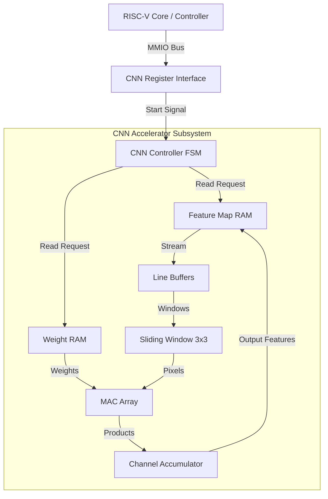

# Architecture Overview

## System Architecture
The Edge AI CNN Accelerator consists of two main pillars:
1. **RISC-V Control Brain**: A RISC-V processor (simplified in this repository to its bus controller form) orchestrates the execution flow. It is responsible for initializing memories and issuing START commands via memory-mapped registers.
2. **CNN Accelerator Pipeline**: A custom hardware pipeline implementing a LeNet-style datapath. It utilizes 3D Convolutions utilizing a line-buffer and sliding-window architecture.

### Block Diagram

## Interaction Flow
- **Firmware Level**: RISC-V writes parameters like `INPUT_WIDTH`, `INPUT_HEIGHT`, and `CHANNELS` to the memory-mapped register interface.
- **Trigger**: Firmware writes `1` to the `START` register (address `0x00`).
- **Accelerator Subsystem**:
  1. The CNN Controller FSM moves from `IDLE` to `LOAD_WINDOW` and starts streaming pixels from RAM into Line Buffers.
  2. The 3x3 Sliding Window populates and passes 9 pixels + 9 weights into the Pipeline MAC Array.
  3. The MAC array computes vector dot-products.
  4. The Channel Accumulator accumulates these intermediate products across the depth/channels of the tensor.
  5. Outputs are written sequentially to the local Feature Map RAM.
- **Polling**: RISC-V polls the `DONE` bit in the `STATUS` register (`0x00`) to determine completion.

## Simulation & Verification
- **Automated Flow**: The project uses an automated Bash script (`scripts/run_simulation.sh`) to compile and simulate testbenches.
- **Waveform compression**: Employs `.fst` (Fast Signal Trace) dump formats instead of `.vcd` to minimize file sizes (reducing debug outputs from up to 17GB to < 1MB).
- **Debug Levels**: Configurable `DEBUG_LEVEL` parameters in testbenches control signal verbosity, from `0` (None) to `3` (Complete).
